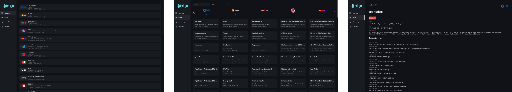
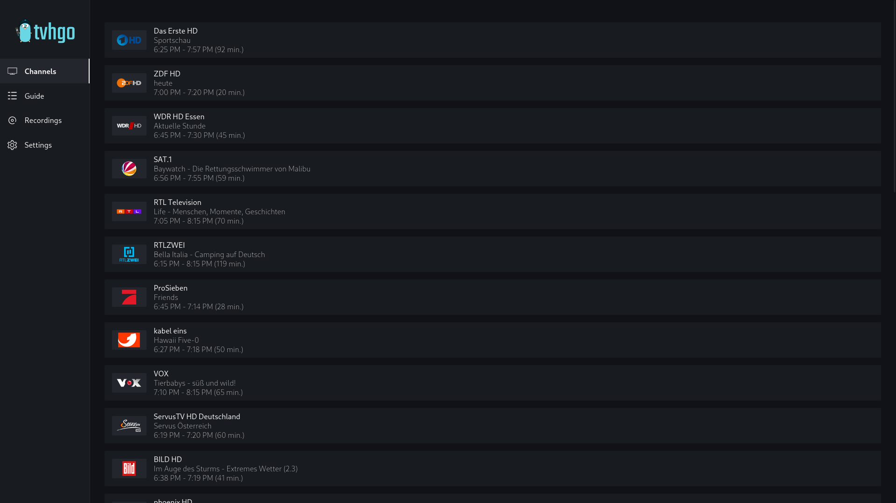
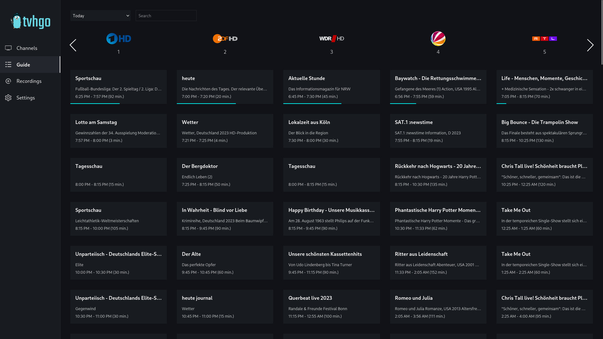
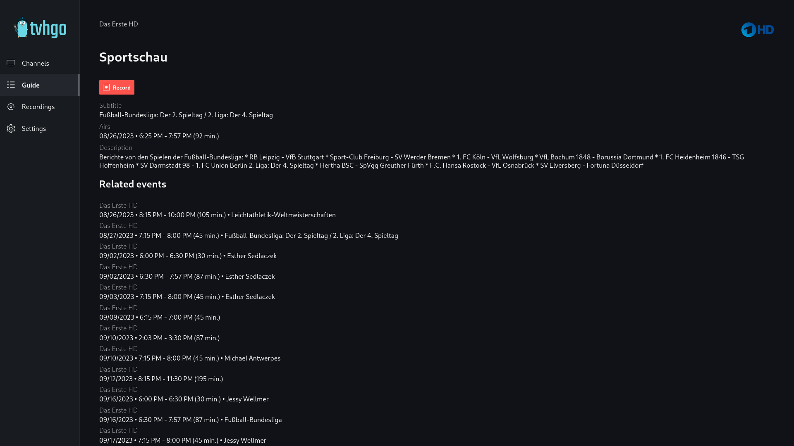

  <a href="#features">Features</a> | 
  <a href="#installation">Installation</a> |
  <a href="#screenshots">Screenshots</a>
  <a href="https://davidborzek.github.io/tvhgo/">Documentation</a>

  tvhgo provides a modern and secure alternative for the Tvheadend web interface and the api.
  It aims to give users an all-round access to Tvheadend from any platform.

## Features

This is a list of available features.

- Channel list
- TV Guide
- Create and manage recordings
- Two-Factor-Authentication
- Multiple Languages (English/German)

## Installation

There are various methods available to install tvhgo. For detailed instructions you can follow these guides:

- [Docker](https://davidborzek.github.io/tvhgo/latest/installation/)

### Configuration

You can more information about the tvhgo configuration in [the wiki](https://davidborzek.github.io/tvhgo/latest/configuration/).

## Screenshots

More screenshots can be found [here](docs/screenshots/).

## Contributing

Contributing and pull requests are very welcome.

More information about contributing to this project can be found [here](CONTRIBUTING.md)
