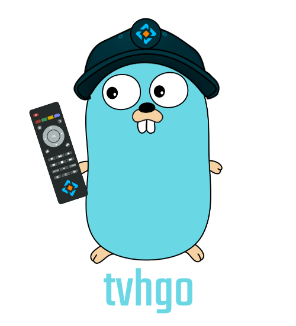

# tvhgo

  

tvhgo provides a modern and secure alternative for the Tvheadend web interface and the api. It aims to give users an all-round access to Tvheadend from any platform.

[:octicons-arrow-right-24: Getting started](installation.md)

## Features

This is a list of available features.

- Channel list
- TV Guide
- Create and manage recordings
- Two-Factor-Authentication
- Multiple Languages (English/German)

## Contributing

Contributing and pull requests are very welcome.

More information about contributing to this project can be found [here](https://github.com/davidborzek/tvhgo/blob/main/CONTRIBUTING.md).
